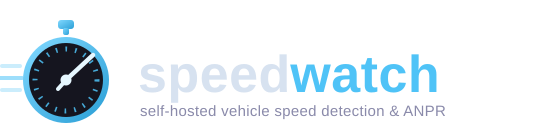
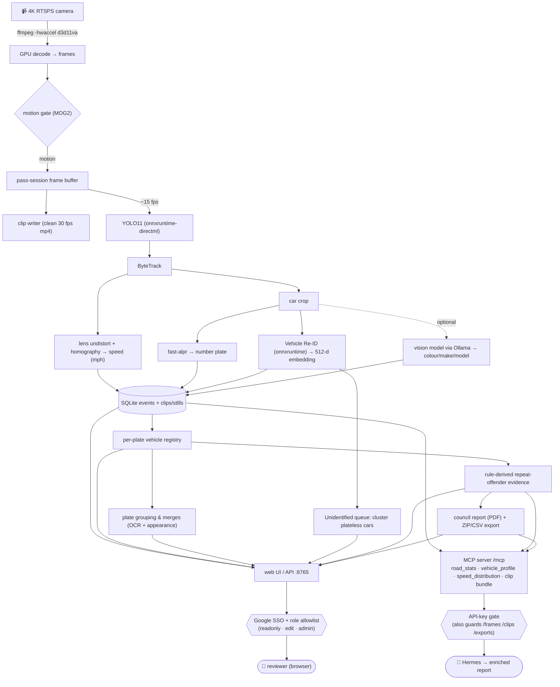

<p align="center">
  
</p>

<p align="center">
  <a href="LICENSE"></a>
  
  
  
  
  
</p>

# speedwatch

Standalone vehicle speed-detection and ANPR service for a single fixed camera. Pulls a
4K RTSPS stream, decodes it on the GPU, runs object detection + tracking, estimates
real-world speed via a homography, reads number plates, and serves clips + events over a
local web UI. Runs as a Windows service (NSSM); no Docker.

Replaced a Frigate deployment — it keeps only clean 30 fps clips and drops empty events.

## Pipeline



- **Decode:** `ffmpeg -hwaccel d3d11va` (4K HEVC, ~40% less CPU than software decode).
- **Detection:** YOLO11 medium ONNX on `DmlExecutionProvider` (DirectML) — ~7 ms/frame
  on the AMD RX 9070 XT vs ~136 ms on CPU (~19× faster).
- **Tracking:** ByteTrack (via `supervision`).
- **Speed:** per-track displacement, lens-undistorted then mapped through a calibrated homography.
- **ANPR:** `fast-alpr` (fast-plate-ocr + open-image-models), reuses the same onnxruntime.
- **Vehicle enrichment (optional):** passes are grouped by plate into a vehicle registry.
  A small **Vehicle Re-ID** model embeds each car crop for visual grouping of plateless /
  look-alike cars (the *Unidentified* queue), and a local **multimodal model via Ollama**
  describes each frequent car's colour/make/model. Both run on the existing onnxruntime /
  Ollama and the pipeline runs fine without them. See
  [Vehicle descriptions & grouping](#vehicle-descriptions--grouping).

## Prerequisites

- Windows 11 with a DirectML-capable GPU (built for **AMD RX 9070 XT / DirectML** — no
  CUDA). `ONNX_PROVIDER=auto` falls back to CPU if no DML device is present.
- Python 3.11+.
- [NSSM](https://nssm.cc/) on `PATH` (or copied to `C:\Windows\System32\nssm.exe`) for
  service install.
- A camera RTSPS stream (developed against a UniFi UDM Protect stream).
- **(Optional) An OpenAI-style model host for vehicle descriptions** — by default
  [Ollama](https://ollama.com/) running locally with a multimodal model pulled
  (`ollama pull llama3.2-vision:11b`). Only needed if you want auto-generated
  colour/make/model descriptions; set `VEHICLE_AUTODESCRIBE=0` to disable entirely.
  Any host exposing Ollama's `/api/generate` works — point `OLLAMA_URL` at it.

## Setup

```powershell
git clone https://github.com/lucvan/speedwatch.git C:\speedwatch
cd C:\speedwatch

# Fetch the gitignored bits (venv, YOLO model, ffmpeg/ffprobe)
.\bootstrap.ps1

# Configure
Copy-Item .env.example .env
notepad .env            # fill in CAMERA_RTSP*, CAMERA_NAME, paths

# Install + start the Windows service (run elevated)
.\install-service.ps1
nssm start speedwatch
```

UI: <http://localhost:8765>

The model weights, `.venv`, and `ffmpeg.exe`/`ffprobe.exe` are **not** in the repo
(see `.gitignore`); `bootstrap.ps1` fetches them so a clean clone is fully deployable.

## Web UI

The UI (`:8765`) is organised around a left sidebar, with a **light/dark toggle** (persisted
per browser). Speeds are **colour-banded** throughout — green below the warn threshold, amber
up to the limit, red over it (`SPEED_WARN_MPH` / `SPEED_LIMIT_MPH`) — so a fast pass stands
out at a glance.

- **Dashboard** — landing page: headline stats (passes today, fastest today, over-limit
  count, vehicles tracked, confirmed speeders), a **road speed-distribution chart** (histogram +
  smoothed curve with the median, 85th-percentile and threshold lines), a *needs-attention* work
  queue (plateless passes, visual clusters to merge, low-confidence reviews), a top-vehicle
  leaderboard, and a recent-passes strip.
- **Passes** — every pass, grouped by day with relative timestamps; filter by label, minimum
  speed, or plateless-only; flag a pass as evidence inline.
- **Vehicles** — per-plate registry with top/average speed and description; sort, or filter to
  confirmed speeders.
- **Vehicle page** — stats, representative image, AI description, plate grouping
  (similar-plate + visually-similar merge candidates), a **speed-vs-the-road chart** (this
  vehicle's passes overlaid on the whole-road distribution, with its percentile rank), and the
  vehicle's pass history (each pass tagged with its road percentile). You can **pin the
  thumbnail** to any pass's image, and **recompute the plate** by combining ANPR reads across
  every pass (see [Vehicle descriptions & grouping](#vehicle-descriptions--grouping)).
- **Unidentified** — plateless passes clustered by appearance, for promotion, merge, or
  grouping into a **no-plate vehicle record**.
- **Review** — low-confidence unlabelled passes for quick triage.
- **Evidence** — rule-derived repeat-offender passes with ZIP/CSV export and a print-ready
  **council report** (see [Confirmed-speeder evidence](#confirmed-speeder-evidence)).
- **Calibrate** — lens + zone calibration (see [Calibration](#calibration)).
- **Settings** — read-only view of the running configuration.
- **Users** *(admin only)* — manage who can sign in and at what role (see
  [Authentication](#authentication)).
- **API keys** *(admin only)* — mint/revoke keys for the MCP server + media access (see
  [MCP integration](#mcp-integration-external-agents)).

## Authentication

The UI can be gated behind **Google SSO** with a per-user allowlist and role-based access.
This is essential if you expose the app beyond `localhost` (e.g. via a reverse proxy or
Tailscale), since the app itself becomes the only access gate.

**Auth is opt-in and config-driven — there is no build flag.** It turns on automatically
whenever `GOOGLE_CLIENT_ID` is set in `.env`:

| `GOOGLE_CLIENT_ID` | Behaviour |
|---|---|
| **set** | Every route requires a signed-in, allow-listed user |
| **blank** (default) | **No authentication** — the app is fully open. A prominent **warning is logged on startup**. Only safe on `localhost` for development. |

> ⚠️ Never expose the app publicly with auth disabled. If `GOOGLE_CLIENT_ID` is blank the
> startup log prints a multi-line `AUTHENTICATION DISABLED` banner — treat it as a red flag.

### How it works

1. **Identity** — Google OpenID Connect. The Google ID token is used **once at login** to
   learn the user's email; the app then issues its own signed-cookie session and never
   stores Google tokens (so it's unaffected by Google's testing-mode refresh-token limits).
2. **Allowlist** — the email must exist in the `app_user` table. Google authenticating an
   account is **not** sufficient; an admin must have added it. Unknown accounts get a 403.
3. **Roles** — `readonly` < `edit` < `admin`, enforced per request:
   - **readonly** — view every page and read-only APIs.
   - **edit** — the above + label/curate/merge/assign/recompute actions.
   - **admin** — everything + calibration changes, deletes, and **user management**.

`BOOTSTRAP_ADMIN` is seeded as an `admin` on first startup (and can't be removed or demoted
through the UI, so you can't lock yourself out). Admins manage everyone else on the **Users**
page: add an email, set/raise/lower its role, or remove it (access is revoked immediately on
the next request — sessions are re-checked against the DB every request).

### Setup

1. In the [Google Cloud Console](https://console.cloud.google.com): configure the OAuth
   consent screen (**External**; add allowed accounts as **test users** while in *Testing*),
   then create an **OAuth client ID → Web application**.
2. Add an **Authorized redirect URI** that exactly matches `OAUTH_REDIRECT_URI`
   (scheme + host, no port/trailing slash), e.g. `https://speedwatch.e49ta.com/auth/callback`.
   Google only accepts HTTPS or `localhost` redirect URIs — a bare-IP/HTTP host won't work,
   so front the app with TLS (reverse proxy / Tailscale) if exposing it.
3. Fill in `GOOGLE_CLIENT_ID`, `GOOGLE_CLIENT_SECRET`, `SESSION_SECRET` and `BOOTSTRAP_ADMIN`
   in `.env`, then restart the service.

Behind a TLS-terminating proxy, run uvicorn with `--proxy-headers` (or set a fixed
`OAUTH_REDIRECT_URI`, as the default does) so the callback URL is built as the external
HTTPS host rather than the internal `http://<ip>:<port>`.

## Configuration (`.env`)

| Key | Meaning |
|---|---|
| `FFMPEG_BIN` / `FFPROBE_BIN` | Path to the ffmpeg/ffprobe binaries |
| `CAMERA_RTSP` | Detect stream URL (`rtsps://<ROUTER_IP>:7441/<KEY>?enableSrtp`) |
| `CAMERA_RTSP_HQ` | Record / high-quality stream URL |
| `CAMERA_NAME` | Logical camera name (used in events/clips) |
| `YOLO_MODEL` | Path to the YOLO11 ONNX model (default `models/yolo11m.onnx`) |
| `ONNX_PROVIDER` | `auto` \| `dml` \| `cpu` |
| `OBJECT_CLASSES` | Comma-separated COCO classes to track (`car,truck,bus`) |
| `DETECT_FPS` | Inference frame rate |
| `MIN_DT_SECONDS` | Minimum track interval used in speed estimation |
| `SPEED_LIMIT_MPH` | Legal limit; speeds above it band **red** in the UI (default `20`) |
| `SPEED_WARN_MPH` | Amber-band lower bound; at/above this up to the limit bands **amber** (default `16`) |
| `DATA_DIR` | Where clips, logs, and the SQLite DB are written |
| `PORT` | Web UI / API port (default `8765`) |
| `HOST` | Bind address — `127.0.0.1` (localhost) or `0.0.0.0` (LAN, needs firewall rule) |
| `GOOGLE_CLIENT_ID` | Google OAuth web-client ID. **Setting this enables authentication** (see [Authentication](#authentication)); blank = open app |
| `GOOGLE_CLIENT_SECRET` | Google OAuth client secret |
| `SESSION_SECRET` | Random string signing the session cookie (e.g. `python -c "import secrets;print(secrets.token_urlsafe(48))"`) |
| `OAUTH_REDIRECT_URI` | Exact redirect URI registered on the Google client (default `https://speedwatch.e49ta.com/auth/callback`) |
| `BOOTSTRAP_ADMIN` | Email seeded as the first `admin` on startup (and protected from removal/demotion) |
| `SESSION_MAX_AGE` | Session lifetime in seconds (default 30 days) |
| `MCP_ENABLED` | Mount the MCP server at `/mcp` for external agents (`1`/`0`, default on; see [MCP integration](#mcp-integration-external-agents)) |
| `MCP_PUBLIC_BASE_URL` | Base URL the agent uses to reach this host for the image/clip URLs in tool responses (default `http://host.docker.internal:8765`) |
| `ENABLE_ALPR` | Toggle number-plate recognition (default on) |
| `ALPR_DETECTOR_MODEL` / `ALPR_OCR_MODEL` | fast-alpr model names (auto-downloaded) |
| `ALPR_MIN_CONF` | Minimum mean OCR confidence to accept a plate read |
| `OLLAMA_URL` | Model host for vehicle descriptions (default `http://localhost:11434`) |
| `VEHICLE_VISION_MODEL` | Multimodal model name (default `llama3.2-vision:11b`) |
| `VEHICLE_AUTODESCRIBE` | Auto-describe frequent vehicles (`1`/`0`, default on) |
| `VEHICLE_MIN_PASSES` | Describe a plate once it has been seen more than this many times |
| `VEHICLE_VISION_TIMEOUT` | Seconds to wait on the vision model per call |
| `VEHICLE_VISION_PROMPT` | Prompt sent to the vision model (default returns `Colour Make Model`) |
| `REID_MODEL` | Vehicle Re-ID ONNX for visual grouping (default `models/vehicle-reid-0001.onnx`, fetched by bootstrap) |
| `REID_PROVIDER` | onnxruntime provider for the embedder (`cpu` \| `dml`; cpu is plenty) |
| `REID_SIM_THRESHOLD` | Cosine similarity to treat two crops as the same car (tune on real footage) |

Additional tuning knobs (frame rates, motion gate, pipeline resolution, plate-merge
sensitivity) have sensible defaults in `app/config.py` and can be overridden in `.env`.

## Lifecycle (NSSM)

```powershell
nssm start  speedwatch
nssm stop   speedwatch
nssm restart speedwatch
nssm status speedwatch
# logs: <DATA_DIR>\logs\stdout.log  /  stderr.log  (rotated daily / 10 MB)
.\install-service.ps1     # re-run elevated to apply parameter changes
```

> NSSM commands need an **elevated** shell. If `nssm` isn't found, copy it from the
> winget package dir to `C:\Windows\System32\nssm.exe` first.

## Calibration

Speed accuracy depends on two calibrations, in this order.

### 1. Lens intrinsics (distortion correction) — do this once per camera

The zone homography is a planar projective transform: it is exact only for a pinhole
camera. A wide-FOV lens adds radial (barrel) distortion that a homography can't represent,
so the pixel→metre mapping drifts toward the frame edges — exactly where a side-on vehicle
enters and leaves frame.

**Easiest: the on-screen slider tuner (plumb-line method).** On `/calibrate`, click
**Tune lens…**, then drag *Strength* (and optionally *Edge*) until things that are straight
in real life — the kerb, road edge, a fence top or wall — line up straight against the green
reference grid, and **Save lens correction**. No printed board needed; absolute scale is set
later by your tape measurements, so the focal control rarely needs touching. This writes the
same intrinsics file the chessboard method produces.

**Most accurate: chessboard calibration.** Print a board and run:

```powershell
# Print a chessboard (a standard 10x7-square board = 9x6 inner corners). Hold it in the
# camera's view and move it around the WHOLE frame — especially the corners/edges where
# distortion is worst — tilting it at varied angles.

# 1. Capture views through the actual camera stream (saves frames where a board is found):
python -m app.intrinsics capture --count 30 --cols 9 --rows 6

# 2. Estimate K + distortion coefficients (writes data/intrinsics/<camera>.json):
python -m app.intrinsics calibrate --cols 9 --rows 6 --square 0.025
```

Aim for a reprojection RMS < 1.0 px (printed at the end of step 2). The intrinsics are then
**baked into the next zone calibration you save**, and the live pipeline undistorts each
ground point before the homography. Without intrinsics everything still runs — just without
distortion correction (and the `/calibrate` page shows a warning).

### 2. Zone homography

Map the image to the ground plane: open `/calibrate`, click the four zone corners on the
snapshot, and enter the four edge lengths + one diagonal (tape-measured on the road). The
resulting matrix turns per-track pixel displacement into metres, then mph. Re-save the zone
calibration after (re)running lens calibration, and whenever the camera is moved or re-aimed.

> **Timing note:** frame timestamps come from a monotonic frame index (ffmpeg emits CFR at
> `DETECT_FPS`), not wall-clock-at-read. Read-time clock jitter used to corrupt `dt` in
> `speed = displacement / dt`, which scaled with speed and threw off faster vehicles.

### ANPR ignore zones (optional)

ANPR reads the plate inside each moving car's bounding-box crop. If a **parked or background
car** sits where its plate falls inside those crops, the detector can keep reading that
background plate for every pass (often at higher OCR confidence than a moving car's blurred
plate). On `/calibrate`, the **ANPR ignore zones** tool lets you drag a box over the offending
plate; any plate whose detection centre lands inside a box is discarded — including misreads
of it, since the filter is positional, not value-based. A car that genuinely drives through is
unaffected (its plate reads elsewhere in the frame). Zones are stored per camera in
`<DATA_DIR>/anpr_mask/<camera>.json` and take effect on the next vehicle (no restart). You can
also add a zone straight from a vehicle's **plate recompute** results (the *🚫 Ignore location*
button) without opening `/calibrate`.

## Vehicle descriptions & grouping

Passes that carry a recognised plate are grouped into a **per-plate vehicle registry**
(the *Vehicles* page), which tracks each car's pass count, top/average speed, and a
representative crop. Two enrichment features sit on top of it:

### AI descriptions (requires a model host)

For any plate seen more than `VEHICLE_MIN_PASSES` times, the best car crop is sent to a
**local multimodal model via Ollama** (`OLLAMA_URL` → `/api/generate`) to generate a short
`Colour Make Model` description (e.g. `Silver Volkswagen Golf`). It can also be triggered
on demand with the **Regenerate** button on a vehicle's page.

- **This is the only part of the system that needs a model host.** Detection, tracking,
  speed and ANPR do **not** use Ollama — they run on onnxruntime/DirectML.
- **Local by design:** crops are sent only to the configured `OLLAMA_URL`; neighbours'
  vehicle imagery never leaves the box. The call runs in a thread executor so it never
  blocks ingest.
- **Fully optional:** with `VEHICLE_AUTODESCRIBE=0` (or no model host reachable) the
  pipeline runs unchanged — vehicles simply have no description. Failures are logged and
  swallowed, not fatal.
- Setup: `ollama pull llama3.2-vision:11b` (or set `VEHICLE_VISION_MODEL` to another
  multimodal model you've pulled). Tune the wording with `VEHICLE_VISION_PROMPT`.

### Plate grouping (OCR-variant merging)

ANPR misreads produce slightly different plate strings for the same car. A vehicle's page
suggests **possible same-car plates** using OCR-aware edit distance, and — when descriptions
exist — corroborates them with **appearance**: a candidate whose colour/make/model matches
is ranked higher and allowed at a looser plate distance (a far-off plate is never suggested
on looks alone). Tick the matches and **Merge** to group them under one canonical plate;
merges are reversible (the raw `pass.plate` is never rewritten).

You can also **manually assign** any pass to a vehicle (handy when the plate wasn't read but
you recognise the car) from the pass's session page — it attaches via a reversible
`assigned_plate` override and the pass then counts toward that vehicle everywhere.

**Recompute a plate from every image.** When a car keeps reading at low confidence, the
vehicle page's **Recompute plate from all images** button re-runs ANPR over every pass's
full-frame stills, then combines the reads two ways — confidence-weighted whole-string scoring
**and** per-position character voting — and suggests a single best plate. Nothing changes until
you confirm: applying it routes through the same reversible merge, so all the vehicle's passes
regroup under the corrected plate. The recompute respects your [ANPR ignore zones](#anpr-ignore-zones-optional),
and any **parked/background plate** that keeps showing up in the results can be masked in one
click via **🚫 Ignore location** (it draws the ignore box for you over the offending plate).

**Pin the representative thumbnail.** By default a vehicle's thumbnail is the crop from its
highest-confidence plate read, which can show the wrong car after you clean up a mis-grouped
pass. Use **Set as thumbnail** on any pass row to pin that pass's image instead; the pin
(`vehicle.rep_pinned`) locks it so the automatic updater never overrides your choice.

### Visual grouping & Unidentified vehicles (Vehicle Re-ID)

Each car crop is embedded with a small **Vehicle Re-ID model** (OpenVINO OMZ
`vehicle-reid-0001` — an OSNet, MIT-licensed, ~8 MB ONNX, run on onnxruntime/CPU; fetched by
`bootstrap.ps1`). The 512-d embedding gives a *visual* similarity signal independent of the
plate:

- **Vehicle page:** a "visually similar vehicles" list suggests merge candidates by
  appearance, alongside the plate/description signals.
- **Pass / session page:** each pass shows the closest-looking **existing vehicles**, so you
  can re-allocate a single pass to a known vehicle in one click (handy when the plate wasn't
  read but you recognise the car).
- **Unidentified page:** passes with **no plate** are clustered by visual similarity so even
  plateless cars get grouped. Each cluster also suggests the closest **existing** vehicles, so
  you can merge it into a known vehicle, promote it to a new one (give it a label and it appears
  in the Vehicles list), or **Group (no plate)** to create a record for a car whose plate was
  never read — it gets a synthetic `UNK-NNNN` id and behaves like any other vehicle, renamable
  later via the recompute/merge tools once a plate turns up. Older passes are embedded on demand
  with the **Embed older passes** button.

Visual similarity finds **look-alikes**, not proven identity (two identical cars embed close),
so it is always a suggestion you confirm. Tune `REID_SIM_THRESHOLD` on real footage: lower it
if one car keeps splitting into groups, raise it if distinct cars get merged. If the model
file is absent, these features simply no-op.

## Confirmed-speeder evidence

Evidence selection is **rule-derived**, so it doesn't depend on hand-curation. A vehicle is a
**repeat offender** — and all its passes become evidence — if it has at least
`REPORT_REPEAT_MIN_OVER` passes recorded over the limit. On top of that you can **manually flag**
an individual pass (from its session) or a whole vehicle (from its page) as a confirmed speeder,
and passes you mark *wrong* on review are excluded. The same rule drives the council report below,
so the two never disagree. Identity is resolved through the same effective-plate logic as the rest
of the app, so a manually-assigned pass is included, not silently dropped.

The **Evidence** page lists every qualifying pass and exports either a **ZIP bundle** (one folder
per pass — video clip + entry/exit stills — plus a `manifest.csv` of date/time, plate and measured
speed) or a **CSV** of that manifest on its own. Passes below `EVIDENCE_MIN_MPH` are excluded as a
noise floor.

### Council report (`/evidence/report`)

A print-ready (browser Save-as-PDF) multi-page evidence document arguing the case for
traffic-calming: a **road-wide speed profile** (the full distribution with the 85th-percentile
benchmark), a **per-offender profile** for each repeat offender (their speed distribution overlaid
on the road, a representative still, and a table of all their passes), and an **LLM-written
narrative** grounded only in the measured figures — generated by a **local** Ollama text model
(`REPORT_LLM_MODEL`) with a deterministic, figures-grounded fallback so the report is complete and
accurate even with Ollama down.

## MCP integration (external agents)

Speedwatch can expose its evidence **data** to an external agent over the **Model Context
Protocol**, so a more capable agent (with its own research tools and larger models) can author an
enriched report while Speedwatch remains the source of truth for the measured figures. A FastMCP
server is mounted on the same uvicorn process at **`/mcp`** (streamable-HTTP); enable/disable with
`MCP_ENABLED`.

**Tools** (read-only data + image/clip URLs, plus an on-demand bundle):

| Tool | Returns |
|---|---|
| `road_stats()` | Road-wide distribution + summary, observation window, vehicle/offender counts |
| `list_offenders()` | Repeat offenders (same rule as the report) with stats + image URL |
| `vehicle_profile(plate)` | One vehicle's stats, description, image, and every pass with clip/still URLs |
| `pass_detail(id)` | All recorded detail for one pass + media URLs |
| `speed_distribution(plate?)` | An embeddable inline-SVG chart (road-wide, or a vehicle overlaid) |
| `request_clip_bundle(plates?, pass_ids?)` | Builds an evidence ZIP and returns a download URL |

Media travels as absolute URLs built from `MCP_PUBLIC_BASE_URL` so the agent can fetch the images
and clips a tool points it at.

**Authentication.** Access is gated by **API keys** (managed on the admin **API keys** page,
`/keys`; only the SHA-256 hash is stored, the raw key is shown once). An MCP client must present
`Authorization: Bearer <key>`; the same key also authorises the media/export routes (`/frames`,
`/clips`, `/exports`, `/api/evidence/export…`) so the agent can fetch images/clips without a browser
session. Requests without a key fall through to Google SSO, so human access is unaffected.

**Connecting a client** — point any MCP client at the endpoint with the key as a header, e.g.:

```yaml
# an MCP client's server config
speedwatch:
  url: "http://<host>:8765/mcp"
  headers:
    Authorization: "Bearer <key created at /keys>"
```

## Acknowledgements

Built on these open-source projects and models:

- [Ultralytics YOLO11](https://github.com/ultralytics/ultralytics) — object detection (AGPL-3.0).
- [Roboflow `supervision`](https://github.com/roboflow/supervision) — ByteTrack tracking, and
  the perspective-transform vehicle-speed approach that this project's homography follows.
- [`fast-alpr`](https://github.com/ankandrew/fast-alpr) +
  [`fast-plate-ocr`](https://github.com/ankandrew/fast-plate-ocr) +
  [`open-image-models`](https://github.com/ankandrew/open-image-models) — number-plate detection & OCR.
- [`vehicle-reid-0001`](https://github.com/openvinotoolkit/open_model_zoo/tree/master/models/public/vehicle-reid-0001)
  from the OpenVINO Open Model Zoo — an [OSNet](https://github.com/KaiyangZhou/deep-person-reid)
  (`deep-person-reid`, MIT) model used for visual vehicle grouping.
- [Ollama](https://github.com/ollama/ollama) + a local multimodal model (e.g. Llama 3.2 Vision)
  — vehicle descriptions.
- [FastAPI](https://github.com/fastapi/fastapi), [onnxruntime](https://github.com/microsoft/onnxruntime),
  and [ffmpeg](https://ffmpeg.org/).
- Inspired by [Frigate](https://github.com/blakeblackshear/frigate), the NVR this setup replaced.

## License

[**AGPL-3.0**](LICENSE). This is inherited from **Ultralytics YOLO11** (the object
detector), which is AGPL-3.0 — a project that uses it for open source must be AGPL-3.0 too,
or hold an Ultralytics commercial licence. The other dependencies are permissive: `supervision`,
`fast-alpr` / `fast-plate-ocr` / `open-image-models`, FastAPI, onnxruntime, and the
`vehicle-reid-0001` Re-ID model (MIT) are all MIT/Apache/BSD.
